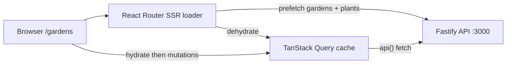

# Home Garden features

The web app is an inventory UI for gardens and plants, built on the existing Fastify API. The problem it solves: a gardener has limited space and needs to remember humidity needs per plant.

Stack choices live in [tech-stack.md](./tech-stack.md). This document covers what users can do and how those capabilities are built.

## User perspective

`/` redirects to `/gardens`. The header has **Gardens** and **My Garden**. Those links do a full document reload. **My Garden** is a stub: “This page is not implemented yet.”

### Gardens

The gardens page lists every garden: name, total surface area, humidity range, and (on desktop) latitude and longitude.

**Add garden** opens a modal. Name and surface area are required. Optional fields: location description; latitude and longitude (both or neither); min and max humidity 0–100 (both or neither, min ≤ max).

Opening a row shows garden details (surface, humidity, location, created/updated times), plus the plants in that garden. **Update garden** edits the same fields. **Delete garden** asks for confirmation, then returns to the list.

An empty list says to add a garden. A failed load shows why and offers **Try again**. A failed create or update shows a toast; clicking it restores the form.

### Plants

The garden detail page lists plants and shows how much surface area they use (`12m² of 20m² currently used`).

**Add plant** collects name, species, type (vegetable, fruit, or flower), plantation date, surface area required, and ideal humidity (0–100). Opening a plant shows those fields plus timestamps. From there the user can update or delete. Delete asks for a second confirmation.

Adding or updating a plant is blocked if it needs more m² than the garden has left. The field explains how much space remains. Shrinking a garden below current plant usage is allowed; the plants section then shows **Plants are overcrowded** with used vs total m².

### Slow API, still usable

While a create or update is in flight, the row looks pending. When another session adds or removes a garden, the list briefly highlights that change. If someone else deletes the garden being viewed, a dialog offers **Stay here** or **Go back to gardens**.

## Technical perspective

The UI is a React Router v7 MPA (`ssr: true`) with TanStack Query, Mantine, and Zod. HTTP goes through a native `api()` helper in [`apps/web/app/lib/api.ts`](../apps/web/app/lib/api.ts).

The gardens layout loader in [`apps/web/app/routes/gardens.tsx`](../apps/web/app/routes/gardens.tsx) prefetches the garden list, and plants when `:gardenId` is valid. `shouldRevalidate` is false for GET moves inside `/gardens`, so list ↔ detail is not blocked by the slow loader.

The cache uses 60s `staleTime`. The browser retries twice; loaders do not retry, so a failed document load is honest. Mutations write the cache with `setQueryData` instead of refetching the slow list. The garden list polls every 15s so another session’s creates show up without a reload.

Client Zod schemas in [`apps/web/app/queries/gardens.ts`](../apps/web/app/queries/gardens.ts) and [`apps/web/app/queries/plants.ts`](../apps/web/app/queries/plants.ts) gate forms. The API also rejects overcrowded plant create/update in `plant.service.ts`. Shrinking a garden is not blocked by the API.

The assignment described a single garden “target humidity” 0–100. The app models a **min–max range** on gardens and a single `idealHumidityLevel` on plants.

Capability tests in [`apps/web/tests/routes/gardens.spec.tsx`](../apps/web/tests/routes/gardens.spec.tsx) cover CRUD, overcrowding, errors, and SSR hydrate (stubbed `fetch`). Unit tests cover Zod schemas and error copy. Playwright in [`apps/web-e2e`](../apps/web-e2e) checks MPA navigation between My Garden and Gardens.

## Requirement coverage

| Requirement | Status |
| --- | --- |
| Garden create, view, update, delete | Done |
| Overview of gardens | Done — global `GET /gardens`, not scoped to a user |
| Configurable humidity 0–100 | Done as min/max range, not a single target |
| Plant create, view, update, delete with properties | Done |
| Overcrowding validation and a clear message | Done — blocked on plant add/update; warning if the garden is shrunk below usage |
| React meta-framework | Done — React Router v7 |
| Useful tests of critical logic | Done |
| Gardens linked to a user account | Not implemented |
| Login / registration | Not implemented (bonus; theoretical below) |
| API speed-up for frequent data | Client mitigations done; no API cache (bonus below) |

**Not in the web UI:** login, user-scoped gardens, Users CRUD (API plus unused wrappers in [`apps/web/app/queries/users.ts`](../apps/web/app/queries/users.ts)), and the `/my-garden` feature.

**Extras beyond the brief:** location description and coordinates; plant species, type, and plantation date; pending rows; cross-session poll highlights; garden-removed dialog; restore form from failed-create/update toasts; SSR hydrate; accessible landmarks, labels, and live busy states.

## Bonus: performance and auth

The API delays 200–2000ms and fails about 10% of requests (`slow-api`, `random-errors`). The UI already hides most of that with SSR prefetch, cache, retries, and mutation cache writes.

A later API-side speed-up for frequent data would cache `GET /gardens` and `GET /plants/garden/:id` (HTTP cache, in-memory store, or CDN) and drop or scope the delay plugin for those GETs. No API cache is implemented.

Users exist as a separate resource (unique email) with no password, session, or `garden.userId`. A later auth design would add a password hash on `user`, a session or JWT, a `garden.userId` foreign key, filter `GET /gardens` by the authenticated user, and protect mutations. There is no login UI.
